# KiTTY features

KiTTY is a fork of [PuTTY](https://www.chiark.greenend.org.uk/~sgtatham/putty/),
Simon Tatham's telnet/SSH client for Windows. On top of everything PuTTY does,
KiTTY adds a large set of convenience and automation features. This page documents
the features that are built into this 0.84-based port, grouped the same way as the
original [KiTTY website](https://github.com/cyd01/KiTTY/) by Cyril Dupont.

Each entry includes a short description, how to turn it on, and a screenshot where
one is available.

**Table of contents**

- **Most requested features**
  - [Sessions filter (folders)](#sessions-filter-folders)
  - [Quick connect (type a host instead of picking a session)](#quick-connect-type-a-host-instead-of-picking-a-session)
  - [Portability](#portability)
  - [Shortcuts for pre-defined commands](#shortcuts-for-pre-defined-commands)
  - [Session launcher](#session-launcher)
  - [Automatic logon script](#automatic-logon-script)
  - [Automatic logon script (RuTTY patch)](#automatic-logon-script-rutty-patch)
  - [URL hyperlinks](#url-hyperlinks)
- **SSH and network**
  - [Automatic password](#automatic-password)
  - [Private-key usage confirmation](#private-key-usage-confirmation)
  - [Post-quantum key-exchange warning](#post-quantum-key-exchange-warning)
  - [Command-line key generator (kittygen-cli)](#command-line-key-generator-kittygen-cli)
  - [SSH certificates (user and host)](#ssh-certificates-user-and-host)
  - [kageant — Windows OpenSSH agent integration](#kageant--windows-openssh-agent-integration)
  - [kageant — load keys on startup](#kageant--load-keys-on-startup)
  - [kageant — reorder loaded keys](#kageant--reorder-loaded-keys)
  - [Port knocking](#port-knocking)
  - [Proxy choice](#proxy-choice)
  - [Workplace proxy mode](#workplace-proxy-mode)
  - [SSH handler (URL/OS integration)](#ssh-handler-urlos-integration)
- **Technical features**
  - [Automatic command](#automatic-command)
  - [Force CR/LF on the Enter key](#force-crlf-on-the-enter-key)
  - [Run a locally saved script on a remote session](#run-a-locally-saved-script-on-a-remote-session)
  - [Standard output to the clipboard](#standard-output-to-the-clipboard)
  - [Restricted process ACL (-restrict-acl)](#restricted-process-acl--restrict-acl)
- **Graphical features**
  - [An icon for each session](#an-icon-for-each-session)
  - [Send to tray](#send-to-tray)
  - [Transparency](#transparency)
  - [Protection against keyboard input](#protection-against-keyboard-input)
  - [Roll-up](#roll-up)
  - [Always on top](#always-on-top)
  - [Font management](#font-management)
  - [Word navigation modifier](#word-navigation-modifier)
  - [Quick start of a duplicate session](#quick-start-of-a-duplicate-session)
  - [Window title placeholders](#window-title-placeholders)
  - [Background image](#background-image)
- **Other features**
  - [Automatic saving](#automatic-saving)
  - [pscp.exe and WinSCP integration](#pscpexe-and-winscp-integration)
  - [Binary compression](#binary-compression)
  - [Clipboard printing](#clipboard-printing)
  - [Start Cygwin or cmd.exe inside KiTTY](#start-cygwin-or-cmdexe-inside-kitty)
  - [File association](#file-association)
  - [ZModem file transfer](#zmodem-file-transfer)
  - [Menu key shortcuts definition](#menu-key-shortcuts-definition)
  - [New command-line options](#new-command-line-options)
  - [Non-blocking connection errors](#non-blocking-connection-errors)
  - [Run the clipboard as a command](#run-the-clipboard-as-a-command)
  - [The remote clipboard (OSC 52, OSC 5522, far2l)](#the-remote-clipboard-osc-52-osc-5522-far2l)
  - [In-app updater (Check for updates)](#in-app-updater-check-for-updates)
- **Bonus**
  - [Hidden text editor](#hidden-text-editor)

---

## Most requested features

### Sessions filter (folders)

If you manage a large number of saved sessions, KiTTY lets you organize them into folders, for example one folder per machine, per environment, or per type of application. A dropdown in the Session panel lets you pick a folder so the saved-session list shows only the sessions it contains, making a long list far easier to navigate. You can also filter the visible list as you type in the Saved Sessions field; prefix and token matches are ranked before substring matches, and folder names are shown in brackets while searching. The root list shows every session, so there each one that lives in a folder is marked with it in brackets; sessions in no folder are left unmarked.

**How to enable:** Automatic in KiTTY mode: the Session panel shows a **Folder** dropdown that filters the saved-session list to one folder, plus New folder / Delete folder controls. To create a folder, pick the **`<new folder...>`** entry at the top of the dropdown, type the name, and click *New folder*. To rename a folder, select it, type the new name over it, and click *Rename* — the button renames itself to say so. The sessions in it move with it. Deleting a folder that still contains sessions asks first, and moves them to the root list rather than deleting them. Sessions that are in no folder live in the root list, shown as **All sessions (root)** — that is not a folder and cannot be deleted, but you can rename what it is called: select it, type your own name over the label, and the button changes to *Rename* to confirm what will happen. Typing the built-in name back restores it. The new name is cosmetic, so no session or setting is moved or changed by it (it is stored as `RootFolderLabel`, in the registry or in kitty.ini's `[KiTTY]` section depending on your save mode). To search within the active folder filter, type in the Saved Sessions field; Up/Down moves into the filtered list and Enter loads or starts the highlighted visible session. Press **Ctrl+F** anywhere in the config window — from any settings panel, or right after starting a session with Enter — to jump back to the Session panel with the search field focused and its content selected, so just typing starts a new search. **Ctrl+G** does the same but searches *everywhere*: it first drops the folder filter back to the root list, so the search covers every saved session instead of only the selected folder. Nothing is loaded, moved or re-filed by it — only the folder filter changes. The two buttons differ in where the session opens: clicking **Open** opens the chosen session in the current window (the config box closes), while **Start** — like pressing Enter — starts it in a new window and keeps the config box open for launching the next one. If you prefer the classic behaviour where typing never narrows the list, set `filter=no` in the kitty.ini `[ConfigBox]` section.

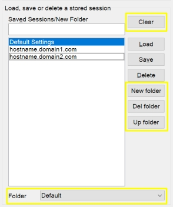

*See also: [How session folders work (PDF)](docs/features/kitty-folders_list_feature.pdf)*

**Browsing folders as rows instead of using the dropdown (optional).** Set
`foldernavigation=yes` in the `[ConfigBox]` section of kitty.ini and folders
become **rows of the saved-session list** rather than entries in a dropdown, the
way a file manager shows directories. The dropdown disappears, since two ways to
change folder in one window is one too many.

In this mode the list shows the folders of the current level first, drawn as
`work/`, then the sessions. Double-click a folder row or press Enter on it to
step inside; the `..` row at the top steps back out. There is one level, so `..`
always returns to the root. The root itself lists only the sessions that are in
no folder — the rest are reached through their folder — which is the difference
you will notice first, because the classic root list shows everything and marks
the filed ones in brackets.

- **Create a folder:** type the name in the session-name box and press
  **New folder**, which sits beside *Save*. No arming step, and creating a
  folder steps into it.
- **Rename a folder:** select its row. Its name appears in the session-name box
  and the *Save* button relabels itself to **Rename**; type the new name over it
  and press the button. Every session in the folder moves with it. Selecting
  anything else, stepping in or out, or pressing Ctrl+F/Ctrl+G ends the rename
  and the button returns to *Save*.
- **Delete a folder:** *Del folder* acts on the folder you are inside, and asks
  before emptying it; the sessions themselves are kept and move to the root.
- **Search across folders:** the root list here holds only the sessions that are
  in no folder, so
  **Ctrl+G** matters more than in the classic mode — it searches every folder
  and marks each result with the folder it lives in, `beta [work]`.

Nothing about storage changes: a folder is still an attribute of a session, so
turning the setting off puts the classic dropdown back exactly as it was, with
every session where it was. The setting is off by default.

**Folders in the menus.** A terminal's **Saved Sessions** menu (the window's
system menu, or right-click on the title bar) groups sessions into a submenu per
folder, with the root-level sessions below them; the tray launcher's menu has always
done the same. This is independent of `foldernavigation` — the menus group
either way.

### Quick connect (type a host instead of picking a session)

The configuration box opens with the session you used last, which is what you want if you work from a list of saved sessions. If you connect by typing an address — a room full of switches, a lab, anything not worth saving — that is the wrong starting point every time: the settings that arrive belong to whichever host you happened to visit last, and the only way back to a known state is to load *Default Settings* by hand before each connection.

Quick connect starts from **Default Settings** instead, with the cursor already in *Host Name (or IP address)* and its contents selected, so an address can be typed over whatever is there and opened with Enter.

**How to enable:** load **Default Settings** once. KiTTY remembers it like any other session, recognises it at the next start, and stays in quick connect until you load a different session — so it is a mode you leave by loading something, not one you have to switch back and forth. Typing an address into an unsaved session records nothing, so the mode survives connecting. To work that way permanently, put `loadlastsession=no` in the `[ConfigBox]` section of your `kitty.ini`; see [docs/KITTY-INI.md](docs/KITTY-INI.md).

(no screenshot)

### Portability

By default KiTTY stores its configuration in the Windows registry. In **portable mode** it instead keeps normal KiTTY runtime state next to the executable/config directory, so you can carry KiTTY, its sessions, and its SSH trust cache on a USB stick. Saved sessions are one file each (`Sessions\<name>`), and SSH host keys, SSH host CAs, the random seed, recent-session state, and the update-check cache are file-backed as well.

**Protecting passwords in portable mode:** the first time a portable install saves an auto-login or proxy password, it offers to set a **master password**, which encrypts saved passwords so the store *does* move between machines. **The master password is never stored and cannot be recovered — if you forget it, the passwords it protected are lost** (you clear and re-enter them). To supply it non-interactively use `-masterpwfile`. Decline the offer and passwords are DPAPI-encrypted instead: protected at rest for the current Windows account, but they will *not* decrypt if you copy the portable folder to another PC. `[KiTTY] PortablePasswordProtection` settles the choice up front — `dpapi` always uses DPAPI and never asks (it cannot be combined with `-masterpwfile`), and `legacy` keeps the classic plaintext form.

**Where the master password lives:** in a `Security` folder inside your portable store, next to the sessions — so the whole folder moves to another PC and still works. Before 0.84.1.65 a portable install kept this in the Windows registry of the machine it was set up on, which meant the copied folder could not open its passwords elsewhere; an install in that state is moved over automatically the next time it starts, and KiTTY shows you where the folder is. If you run several portable copies that share one master password, copy that `Security` folder into each of them.

**Turning the master password off — and why KiTTY may keep asking for it.** Switching protection off (`[KiTTY] PortablePasswordProtection=dpapi`) changes what is written **from now on**. It does not rewrite what is already saved: each stored password carries its own marker saying how it was protected, so passwords saved earlier are still master-password-protected and KiTTY still asks for the master password when you open one of those sessions. Each session converts itself the next time it is **saved**, so the prompts fade as you use and re-save your sessions — but a session you rarely save keeps asking indefinitely.

To convert everything in one go, use **Export all…** followed by **Import all…** into the same store: imported passwords are re-protected by the store they arrive in, which is DPAPI once you have switched. That covers named proxies as well as sessions. Once nothing is left that needs the master password, KiTTY retires it by itself the next time it starts. Delete the exported folder afterwards — while it exists it holds every one of those passwords, protected only by the password you gave the export.

**If you have forgotten the master password there is no way back.** It is not stored anywhere and the protected values carry everything needed to check a password but nothing that can reveal one, so no setting, button or reinstall can recover them. The only remedy is to clear those passwords and type them in again. KiTTY deliberately offers no "remove protection" button, because the only thing such a button could honestly do is destroy the passwords it was protecting.

**Command-line tools use the registry:** `klink`/`kscp`/`ksftp` (plink/pscp/psftp) read saved sessions from the Windows registry, not from a portable store — so a portable install's sessions, and any passwords a master password protects there, are usable from the KiTTY GUI but not from the command-line tools.

**How to enable:** Use the dedicated **kitty_portable.exe** (defaults to file mode), or place a `kitty.ini` next to `kitty.exe` containing `[KiTTY]` then `savemode=dir`. The release includes `kitty.ini.example` as a commented, inert starting point; copy/rename it only when you want an active config file.

(no screenshot)

### Shortcuts for pre-defined commands

KiTTY lets you define your own list of pre-defined commands that appear in a dedicated **User Command** submenu of the KiTTY menu — the one you get by right-clicking the title bar, or by holding Ctrl and right-clicking anywhere inside the window. The submenu is only shown once at least one command is defined, so an empty `Commands` key means no menu entry at all. Each command you define is automatically assigned a keyboard shortcut (Ctrl+Shift+A, Ctrl+Shift+B, and so on, in the order the store lists them — the menu label tells you which letter a command got), so you can fire frequently used commands instantly. You can add as many commands as you like, and define them globally, per saved session, or per session folder. If the shortcuts ever clash with another program running inside the window (for example Midnight Commander), you can turn them off by adding `shortcuts=no` under a `[KiTTY]` section in your `kitty.ini` file.

**How to define them.** There is no editor for this yet — the commands live in the
settings store and are edited by hand.

In registry mode (the default), each command is one **value** under a `Commands`
key. The value *name* is the menu label; the value *data* is what gets sent:

| Scope | Key |
|---|---|
| Global | `HKCU\Software\kapper.net\KiTTY\Commands` |
| Per folder | `HKCU\Software\kapper.net\KiTTY\Folders\<folder>\Commands` |
| Per session | `HKCU\Software\kapper.net\KiTTY\Sessions\<session>\Commands` |

The data is tried as a **filename** first: if it names a readable file, every line
of that file is sent in turn; otherwise the text itself is sent. Either way it
goes through the same send-text path as the other KiTTY shortcuts, so `\n` sends
Enter. Session keys use the escaped session name (spaces become `%20`).

In portable / `savemode=dir` mode the same lists are files under
`<configdir>\Commands` (and `Sessions_Commands\<session>`), one command per line
in the form `label\command\` — the trailing backslash is required. **Accelerators
are not assigned in this mode**: the directory reader builds the menu without
them, so the commands are click-only.

**About the Ctrl+Shift+letter accelerators.** The first 26 commands get one each,
in the order the store enumerates them — which is not necessarily the order you
created them in, and can shift when you add or rename a command. The menu label
shows which letter a command actually has; trust that rather than counting. A
letter with no command behind it is left alone, and an explicit binding in
`[Shortcuts]` always wins over the accelerator, so you can bind e.g.
`eventlog={CONTROL}{SHIFT}L` without it being swallowed. To turn the whole
mechanism off, set `shortcuts=no` in the `[KiTTY]` section of `kitty.ini`.

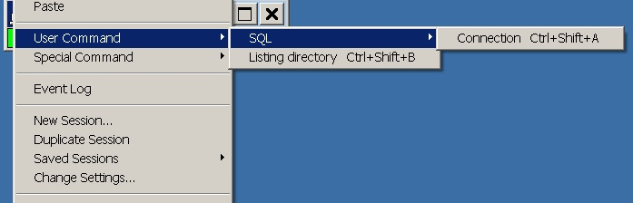

### Session launcher

The session launcher gives you a quick way to open your saved sessions without digging through menus. It lives in the system tray and lists your sessions organized into menus and sub-menus that mirror your session folders, using the backslash (\) as the separator. By default it rebuilds its menu from your saved sessions each time it starts, but you can also arrange the menu yourself and keep it fixed. It also includes an **Opened sessions** menu that lets you hide and unhide running sessions, removing them from the desktop and taskbar when you have too many open at once. When the launcher detects that a newer KiTTY release is available, the tray tooltip mentions the available version and the launcher menu shows a disabled **Update available: KiTTY ...** line, so the notice is not lost if a Windows tray balloon is suppressed.

**How to enable:** Run **`kitty.exe -launcher`** to open the tray launcher listing your saved sessions.

You can keep individual sessions out of the launcher menu while leaving them in the normal session list: tick **"Hide this session from the launcher"** in the session's **Session** panel.

For favourite sessions, you can assign a **global hotkey** in the session's **Window → Behaviour** panel. The hotkey is registered only while `kitty.exe -launcher` is running; when you save a session, a running launcher is notified and refreshes its registered hotkeys automatically. The same panel includes a check button that tells you whether the combination is currently available or already reserved by Windows/another application.

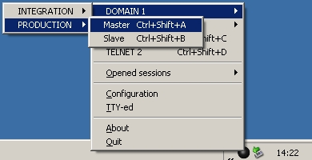

### Automatic logon script

KiTTY can automatically respond to a server's login prompts using a simple challenge-and-response script. You write a plain text file that alternates lines: an expected piece of text the server prints (such as `login:` or `password:`), followed by the text KiTTY should send in reply. This is handy for automating connections to passive protocols like telnet, where you can have your username and password sent for you. Note that it cannot handle SSH authentication, since SSH builds authentication into the protocol itself rather than exchanging plain prompts.

The script is stored with the session and protected at rest, the same way a stored password is, but the configuration box shows and edits it in the clear: one entry per line, expected text and reply alternating.

**How to enable:** Configuration > **Connection > Data**, *Login script*: type the lines directly, or use **Load from file** to read an existing script in. You can also launch with **`kitty.exe -loginscript <file>`**. It runs on connect, on **Restart Session**, and on every automatic reconnect.

⚠️ This and the **rutty** scripting under *Session → Scripting* both watch what the server sends. If you configure both, KiTTY warns you and runs the login script first; prefer one or the other per session.

(no screenshot)

### Automatic logon script (RuTTY patch)

Based on the RuTTY patch, this lets you automate actions on a session by running a small script as soon as you connect. The script uses simple waitfor/halton commands to watch for text from the server and send responses, so common logon sequences and repetitive steps happen for you automatically. It is a handy way to script logins and routine interactions without typing them each time.

**How to enable:** Configuration > **Connection > Scripting**: set a RuTTY script (waitfor/halton style). It plays automatically once connected. You can also run a script on demand in a live session: system menu > **Tools > Send recorded script**. The whole engine can be disabled with `[KiTTY] scriptmode=no` in `kitty.ini`.

**Script file format** (see [docs/examples/logon-script.ksh](docs/examples/logon-script.ksh)):
a script is a plain text file sent line by line. With **Wait for a prompt before
each line** enabled, KiTTY waits until the server's output ends with the
**Wait-for text** (e.g. `$`) before sending the next line, aborts when the
**Halt-on text** appears, and gives up after the configured **Timeout**. Lines
starting with the condition character twice (`::` by default) are comments.
With **Use conditions from file** enabled, a line starting with a single `:`
overrides the wait pattern for the following line only:

```
:: minimal logon script: run two commands, each after a "$" prompt
uname -a
df -h
:password:
secret123
:: the line above is sent only after the server printed "password:"
```

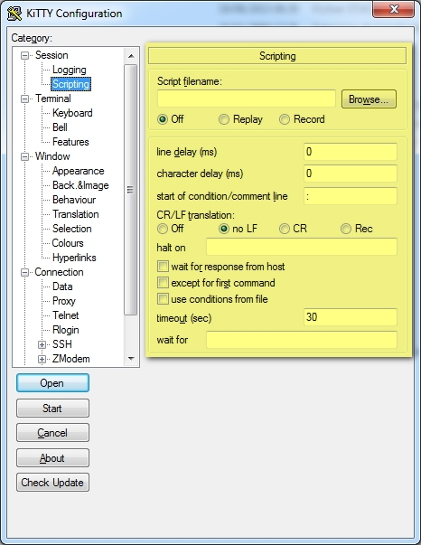

### URL hyperlinks

KiTTY can detect URLs in the terminal output and turn them into clickable hyperlinks, so you can jump straight to a web address without copying and pasting it. You decide how links behave, including whether they are underlined, which modifier key activates them, and which browser opens them. This makes it quick to follow links that appear in logs, command output, or chat sessions.

**How to enable:** Configuration > **Window > Hyperlinks**: choose underline, whether Ctrl is required to activate links, browser, and optional hand cursor on hover. Ctrl+click a URL in the terminal to open it by default.

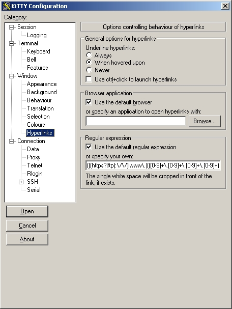

---

## SSH and network

### In-terminal (inline) security confirmations

KiTTY's SSH security confirmations — an unknown (first-seen) host key, a changed host key, or a weak/legacy algorithm (including key exchange) — are shown as modal dialog boxes by default. Each can optionally be shown **inline in the terminal instead**, OpenSSH-style: the details are printed in the session window and you answer by typing, so the prompt never steals window focus. Every choice the dialog offers is available inline too, so nothing is lost by going inline.

- **Unknown host key** — type `yes` to accept and cache the key, or `once` to connect this time without caching it (anything else cancels).
- **Changed host key** — a deliberate two-step confirmation. Type `yes` to accept the new key for *this* connection; then, because KiTTY cannot verify the authenticity of a plain SSH host key (it is trusted on first use), type the exact word `confirmed` to *replace* the stored key for future connections. A reflexive `yes` is re-asked rather than accepted; `no` or Enter keeps the old key and connects once; `Ctrl-C`/`Ctrl-D` abandons. The heading and security warning are highlighted.
- **Weak algorithm / key exchange** — type `yes` to accept the risk and continue.

During an already-authenticated session (a rekey) the running program owns the terminal, so these cannot be prompted inline — KiTTY prints the details and abandons the connection instead (reconnect to review). Connection error messages can likewise be shown in the terminal rather than a box (see `modalerrors`).

**How to enable:** in `kitty.ini [KiTTY]`, set `modalnewhostkeyconfirmation`, `modalchangedhostkeyconfirmation` and/or `modalweakkeyconfirmation` to `no` (default `yes` = classic modal dialog). Each is independent, so you can keep some prompts modal and make others inline.

### Automatic password

KiTTY can log you in automatically to telnet, SSH-1 and SSH-2 servers by storing a password alongside the session. For SSH connections the password is supplied during authentication; for telnet it is sent once the connection comes up, just as if you typed it, and you can even send several lines (for example a login name, a password, and a command) by separating them with `\n`. Because the stored value is tied to the host, a password cannot be saved in a session that has an empty hostname.

**How to enable:** Configuration > **Connection > Data > Auto-login password**. It is stored with the session and sent automatically at SSH login. Tick **Show password** beside the field to reveal the stored value. As of 0.84.1.38 the password is **encrypted at rest with Windows DPAPI** (tied to your Windows account), rather than stored reversibly; existing/legacy passwords still load and are re-encrypted on the next save. NOTE: a one-time security warning still appears when you set one. DPAPI is machine-bound (it defeats offline/cross-user theft, not same-user malware, and does not move to another PC) — for the strongest security, prefer SSH public-key auth (kageant). In **portable mode** you can additionally protect it with a **master password** for cross-machine portability, which — unlike DPAPI — cannot be recovered if you forget it (see *Portable mode*). You are asked for the master password **once per running KiTTY**: unlocking it once shares it with the session windows KiTTY opens next — from the config box, *New Session*, *Duplicate Session*, or the tray launcher — so you are not prompted again for each window. The unlock is handed only to KiTTY's own child processes (through an inherited handle, wrapped in memory with Windows CryptProtectMemory); the saved files stay master-password-encrypted at rest.

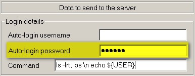

### Private-key usage confirmation

When you store private keys in KiTTY's key agent (kageant), you can require an explicit confirmation each time a key is used. With this enabled, every session that needs the key triggers a pop-up asking you to approve its use before authentication proceeds, giving you a clear chance to spot and refuse unexpected sign-in attempts. This adds a helpful safeguard against a loaded key being used without your knowledge. Thanks to [Patrick Cernko](https://people.mpi-klsb.mpg.de/~pcernko/pageant.html) for this patch.

**How to enable:** For all keys at once, tick **"Ask confirmation before key use"** in the kageant tray menu (persisted, default off): every signing request then pops an allow/deny prompt naming the key. Or per key: generate a key whose **comment contains the word `confirmation`** (in kittygen), then load it into **kageant.exe** — only that key asks for confirmation. Or from **kitty.ini**: `[Agent] askconfirmation=` with the classic three states — `yes` (every use), `auto` (per-key comments only; the default), `no` (never — also silences the per-key prompts, for automation). kageant finds the ini on its own (`KITTY_INI_FILE`, else next to the exe, else `%APPDATA%`); when that file says `[KiTTY] savemode=file` or `dir` — or, with no savemode line, when a portable layout (a `Sessions` folder or `KiTTYState` file) sits beside it — the ini is the authoritative store and the tray toggle writes back to it, so a **portable** kageant never touches the registry; the key-list window and the tray tooltip show *kitty.ini mode* when this is in effect. The related **“Notify when a key is used”** tray balloon (default on) is controllable the same way with `[Agent] messageonkeyusage=yes/no`.

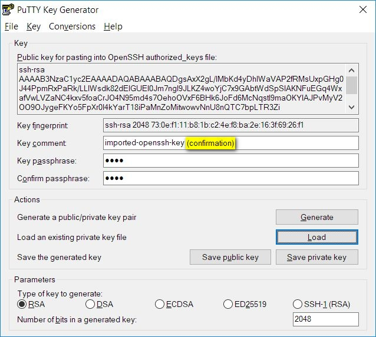
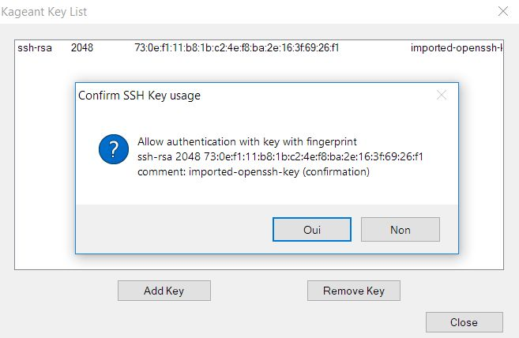


### kageant — Windows OpenSSH agent integration

kageant (KiTTY's SSH agent) can act as the agent for the **Windows OpenSSH client** (`ssh.exe`), so the keys you load in kageant are usable by `ssh`, `git`, `scp` and any tool that uses Windows OpenSSH. When enabled, kageant writes `%USERPROFILE%\.ssh\kageant.conf` (an `IdentityAgent` line pointing at its named pipe) and adds a marker-delimited managed block to `%USERPROFILE%\.ssh\config` that includes it. It is **off by default** so kageant never alters your SSH configuration unless you ask, and only its own marker block is touched (the rest of `~/.ssh/config` is preserved byte-for-byte, written atomically, with a one-time `config.kageant.bak` backup).

**How to enable:** right-click the kageant tray icon → **Register as Windows OpenSSH agent**. Untick to remove the managed block again.

(no screenshot)

### kageant — load keys on startup

kageant can remember the keys you load and re-add them automatically at the next login, added **encrypted/deferred** (the passphrase is only requested the first time a key is actually used). After a passphrase-protected SSH-2 key is first used, kageant returns the long-lived in-memory key state to a Windows `CryptProtectMemory`-protected private blob and only unprotects/deserializes it temporarily for signing. Normally added SSH-2 keys use the same protected steady state. It auto-tracks the file paths of the keys you load; enabling the option also installs an autostart entry so kageant starts at login — replacing the need for a hand-made Startup shortcut. Only key-file *paths* are stored, never passphrases or key material.

In a **portable** install (kitty.ini authoritative — see the confirmation section) the list lives in kitty.ini instead of the registry, so it travels with the stick: keys inside the install folder are stored as paths relative to it (surviving a drive-letter change), and a key added from elsewhere prompts you to either copy it into the portable  folder or reference it where it is (machine-local). The autostart itself is machine-local either way: a portable kageant places a **login shortcut in your Startup folder** (registry-free), while an installed/registry-mode kageant uses the classic `HKCU\…\Run` entry. Both are pinned to the current machine and path rather than following the stick — handy for a fixed or unattended install — and disabling the option removes them. Because the agent is single-instance, if another kageant/pageant is already set to autostart from a different location, enabling this warns you (only one agent runs at a time; it does not touch the other entry). If a remembered key cannot be found at startup (e.g. the stick is on another machine), kageant shows a single tray notice and skips it rather than dropping it from the list. The tray launcher has the same one-click **Start at login** toggle (a Startup-folder shortcut) in its menu.

A key that was not there at startup stays on the list and is loaded when its file turns up — when a drive is plugged in, when a key that was unloaded with its media comes back, or when you press **Retry unavailable keys** in the key-list window, beside *Show unavailable keys* (useful for a file that came back over the network, or a stick that was already in when kageant started; the button is greyed out when no key is waiting). Either way the key is checked against the fingerprint kageant recorded for that path — the check is made on the key the agent actually ends up holding, not on a separate look at the file beforehand — and a key that is **not** the one it remembers is refused rather than kept: the key list shows its State as *mismatch* (the details of that key spell out what happened), and a tray notice says so. Nothing is asked while you are logging in or plugging something in. If **you** replaced the key, open that row in the key list and use **Accept this key**: it shows the fingerprint recorded against the one the file holds now, and only then remembers the new one. A key with no fingerprint on record yet — one remembered by an older version — loads once and is recorded then, and kageant tells you that too.

**How to enable:** right-click the kageant tray icon → **Load keys on startup**.

(no screenshot)

### kageant — reorder loaded keys

kageant offers its loaded keys to a server in list order, and the server tries them in turn — so the order matters when you hold several keys (offering the wrong ones first can even hit a server's "too many authentication failures" limit before the right key is reached). The key-list window has **Move Up** / **Move Down** buttons to set that offer order, e.g. to put your most-used key first. The chosen order is saved by key fingerprint and restored on the next start, including when *Load keys on startup* is enabled. Reordering works independently of whether a key is still encrypted/deferred, already protected in memory, or temporarily unprotected for a signing operation.

**How to enable:** in the kageant key-list window, select a key and use the **Move Up** / **Move Down** buttons.

(no screenshot)

### Post-quantum key-exchange warning

When you connect to an SSH server, KiTTY checks whether the negotiated key-exchange algorithm is one of the post-quantum hybrid algorithms (mlkem768x25519, mlkem768nistp256, mlkem1024nistp384, sntrup761x25519). If the server does not support any of these — which is common on older or unpatched servers — the key exchange falls back to a classical algorithm. KiTTY prints a warning to the terminal at connection time so you know the session is not protected against "harvest now, decrypt later" attacks.

This mirrors the behaviour added in OpenSSH 10.1/10.2 and is enabled by default.

**How to enable:** On by default. To turn it off: **Connection > SSH > Kex > Warn if Key Exchange is not post-quantum secure** (uncheck). The warning appears once per session (not on rekey).

(no screenshot)

### Command-line key generator (kittygen-cli)

`kittygen-cli.exe` is a console-mode SSH key generator that brings the full `puttygen` CLI to Windows. The existing `kittygen.exe` is a GUI tool only; `kittygen-cli` lets you generate, convert, and inspect keys from a script, a CI pipeline, or any Windows console without opening a GUI window.

Supported operations:

| What | Example |
|---|---|
| Generate Ed25519 key | `kittygen-cli -t ed25519 --new-passphrase NUL -o mykey.ppk` |
| Generate RSA 3072 key | `kittygen-cli -t rsa -b 3072 --new-passphrase NUL -o mykey.ppk` |
| Export PPK → OpenSSH | `kittygen-cli mykey.ppk -O private-openssh -o mykey` |
| Export OpenSSH → PPK | `kittygen-cli mykey -O private -o mykey.ppk` |
| Show fingerprint | `kittygen-cli -l mykey.ppk` |
| Show public key | `kittygen-cli -O public-openssh mykey.ppk` |
| Change passphrase | `kittygen-cli mykey.ppk -P --new-passphrase newpass.txt -o mykey.ppk` |

The full set of key types, output formats, and Argon2 KDF options from upstream PuTTY are all available. Run `kittygen-cli --help` for the complete list.

`kittygen-cli.exe` is included in the installer and the release ZIP alongside `kittygen.exe`. It does not have a Start-menu shortcut (it is a command-line tool; add it to your `PATH` for convenience).

(no screenshot)

### SSH certificates (user and host)

Instead of copying every public key into `authorized_keys` on every server, a **certification authority** signs your key once and each server is told to trust that CA — with an expiry date and a list of principals attached. The same idea works in the other direction: a server whose host key carries a certificate is trusted from the first connection, so "the host key is not cached" stops happening on every new or rebuilt machine. KiTTY supports both halves.

**How to enable:** for your own key, **kittygen** > `Key` > **Add certificate to key** (the certificate is then carried inside the `.ppk`), or keep it as a separate file and point Configuration > **Connection > SSH > Auth > Credentials** > *"Certificate to use with the private key (optional)"* at it — the second is easier when certificates are short-lived, since renewing one is then a file drop with no key handling. From a script, `kittygen-cli --certificate <file>` does the same, and `kittygen-cli -O cert-info` prints what a certificate asserts. To trust a CA that signs **host** keys, use Configuration > **Connection > SSH > Host keys** > *Configure host CAs* (stored per user, and portable-mode friendly). On the command line, `-i <key.ppk> -cert <certificate>` works for `kitty.exe`, `klink.exe`, `kscp.exe` and `ksftp.exe`.

**[Full how-to, including the OpenSSH server side →](docs/SSH-CERTIFICATES.md)** — certifying a key step by step, `TrustedUserCAKeys` / `AuthorizedPrincipalsFile`, host certificates, a throwaway local lab to try it all safely, and what the common failures mean.

(no screenshot)

### Port knocking

Port knocking lets you hide a server's SSH port behind a secret sequence of connection attempts, so the real service stays closed to anyone who doesn't know the pattern. KiTTY can send this knock sequence automatically just before it opens the actual connection, making it easy to reach servers that are otherwise locked down against attacks from the internet. You define the sequence as a comma-separated list, and KiTTY performs the knocks for you each time you connect.

**How to enable:** Configuration > **Connection > Port knocking**: define the sequence of host:port knocks sent before the real connection is opened.

(no screenshot)

### Proxy choice

When you regularly reach hosts through a bastion, jump server, or a corporate HTTP/SOCKS proxy, Proxy choice saves you from setting up the same proxy by hand for every session. You define your proxies once as reusable **named proxies**, then use one of two controls: the **Proxy override options** dropdown in the Session panel amends the *next connection only* and never writes anything into the session, while **Load into this window** on the Connection/Proxy panel adopts a preset into the settings you are editing, so a Save keeps it. The caption of the dropdown changes to **PROXY OVERRIDE ACTIVE** in bold red whenever the choice would make the connection differ from what the stored session says — including picking *No proxy* for a session that has one. This is handy when you keep a SOCKS proxy open on a bastion (for example via a dynamic port forward), or route through a company HTTP proxy, and don't want to re-enter it on the Connection/Proxy panel every time.

Named proxies are managed from a built-in editor — an **Edit** button sits next to the dropdown, and on the Connection/Proxy panel — where you create, edit, and delete definitions with the full set of proxy settings: type, host, port, username/password, the command for Telnet/Local types, excluded hosts, DNS-at-proxy, and diagnostics. Each proxy's password is **encrypted at rest** exactly like a session password (Windows DPAPI in the registry, or your master password in portable mode), and is decrypted only when a session that uses the proxy actually connects.

A named proxy can also be an **SSH jump host**: pick one of the *SSH jump host* types in the editor and KiTTY opens a real SSH connection to that host and tunnels the session through it (the equivalent of OpenSSH's `ProxyJump`). The three variants differ in *how* the tunnel is made on the jump host:

- **SSH jump host (port forwarding)** — the normal choice. After logging in to the jump host, KiTTY asks its SSH server for a standard forwarded connection to the destination (a `direct-tcpip` channel, like `ssh -J` / `plink -nc`). Nothing is executed on the jump host, so it works even for restricted accounts with no shell — but the server must allow port forwarding.
- **SSH jump host (execute a command)** — for jump hosts where port forwarding is disabled but you can run programs: KiTTY logs in, runs the command from the *Command* field on the jump host, and uses that command's input/output as the tunnel. `%host` and `%port` in the command are replaced by the real destination, e.g. `nc %host %port` or `socat - TCP:%host:%port`.
- **SSH jump host (invoke a subsystem)** — like *execute a command*, but starts a named SSH **subsystem** (the *Command* field holds the subsystem name) instead of a shell command. Only useful when the jump host's sshd is configured with a dedicated forwarding subsystem; if you don't know you need this, you don't.

**Leaving the proxy password empty is normal for an SSH jump host** — the jump connection then authenticates like any other SSH session: keys loaded in **kageant** are tried automatically, then a private key file, and only if none of that works are you asked for a password at connect time. The jump host's host key is checked and cached like any other host's. (For the non-SSH types the empty password behaves differently: an HTTP or SOCKS5 proxy asks you for credentials only *after* it has rejected the anonymous attempt.)

**Where the jump host's settings come from.** Unlike OpenSSH's `ProxyJump`, the jump connection does *not* inherit the target session's settings — KiTTY loads a separate configuration for it, and which one depends on how the proxy was defined:

- **A named proxy says what its Name indicates** — the *.. this is ..* setting in the editor, beside the Name/IP field. *A hostname or IP-address* uses your **Default Settings** with the proxy's own host, port, username and password applied on top. *Possibly the name of a saved session* keeps PuTTY's rule, where a Host matching a saved session loads that entire session as the jump configuration. A proxy that says neither follows `[KiTTY] namedproxy=` in kitty.ini, which is `sessionorhostname` — PuTTY's behaviour, and the default — unless you set it to `hostname`. The choice exists because the old rule is invisible when it fires: a jump host that happens to share a name with a saved session drags that session's own proxy in with it, so an SSH jump can silently run through an unrelated HTTP proxy. The Event Log names which reading was used on every connection.
- **A host typed by hand on the Connection/Proxy panel** keeps the upstream PuTTY behaviour: if it matches the name of one of your **saved sessions**, that whole session is used — its private-key file, username, port, agent setting and its own proxy — otherwise it is a bare hostname and Default Settings apply.

Either way, agent authentication to the jump host follows the *Attempt authentication using kageant (Pageant)* checkbox (Connection → SSH → Auth) of *that* configuration, not of the target session. So if the jump host needs a specific private key rather than an agent key, save a session for it and type that session's name as the proxy host by hand.

**Multiple jump hops.** There is no comma-separated jump list; chain instead. Because a hand-typed proxy host that names a saved session inherits *that* session's proxy too, you can reach `A → B → C` by giving session C a proxy whose host is the saved session B, whose own proxy points at A. The chain is **bounded at 5 hops** so that a chain which loops back on itself fails with an error naming the limit instead of hanging; raise or lower it with `[KiTTY] proxychainmax=` in kitty.ini. Each link is written to the Event Log as `proxy chain link N: host port`.

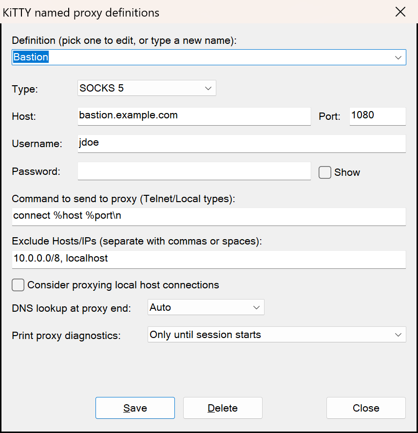

**How to enable:** The dropdown appears automatically once you have any named proxy defined — click **Edit** beside it (which opens the editor on the definition currently selected) or the button on the Connection/Proxy panel to add one. Pick it from the Session panel to override the next connection only, or use **Load into this window** on the Connection/Proxy panel to make it part of the session; that one asks for confirmation first, naming everything it replaces (including the username and password), and warns in red when the session has *Save settings on exit* enabled and the change would therefore persist without an explicit Save. To force the dropdown always on or off, set `[ConfigBox]` `proxyselection=yes` (or `no`) in kitty.ini; the default is `auto`.

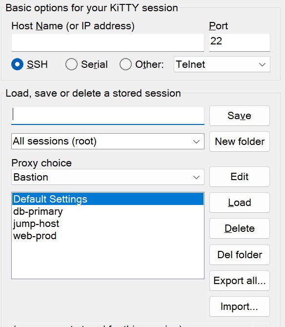

### Workplace proxy mode

Some days the proxy is not a property of any session — it is a fact about where you are sitting. At a customer site, on a VPN, or in a hotel, *everything* has to go through one local proxy, and editing every session to say so (and then remembering to undo it) is the wrong shape of work.

Workplace proxy mode is that switch. Pick one of your named proxies, say how long for, and until it is switched off **every** connection KiTTY makes goes through it — from the configuration box, the launcher, a desktop shortcut, an `ssh://` link or an auto-reconnect — whatever each session stores. **No session is modified**, so there is nothing to undo afterwards.

**Switching it on and off.** *Connection → Proxy* has the switch at the foot of the panel, set apart because it is not a setting of the session in front of you: choose the proxy, choose *Switch off after* (1, 2, 4, 8 or 12 hours, or only when the launcher exits) and press **Switch on**. The launcher's tray menu does the same in one click, using the proxy and duration you chose last. Either place can switch it off again.

**How it ends.** The mode is held by the session launcher: switch it off yourself, let the time run out, or stop the launcher — logging off, shutting down or killing it all end the mode, and nothing is left behind to surprise you tomorrow. A launcher that KiTTY started only to hold the mode closes again when the mode ends, unless you set `[Launcher] exitwithworkplace=no`; a launcher you started yourself always stays.

**Seeing it.** A window whose connection really went through the proxy shows a dark green frame and `⇄ workplace proxy` in its title, for as long as that connection lives. This describes the *connection*, not the mode: a window that was already open when you switched the mode on is not going through it and says nothing, and one that is keeps saying so even after the mode ends, because a connection that is already established cannot be re-routed. The launcher's tooltip names the proxy and the time left, and a notice near the clock says when the mode goes on, off, or times out — once each, never on every start. Only the timeout notice offers to switch it back on; if you switched it off yourself, KiTTY assumes you meant it.

**When the proxy stops answering** — usually because you have left the place it belongs to — the failed connection offers to take you to *Connection → Proxy*, where you can switch the mode off or point it somewhere else. It does not switch anything off for you.

**How to enable:** define at least one named proxy (above), then *Connection → Proxy* → **Switch on**, or the launcher's tray menu. The duration notice can be lengthened with `[Launcher] noticeseconds=` in kitty.ini.

### SSH handler (URL/OS integration)

KiTTY can register itself with Windows as the program that opens **ssh://**, **telnet://** and **kitty://** links. Once registered, clicking such a link in a browser, a mail client or any other application launches KiTTY and connects. That makes it easy to publish clickable connection links on intranet pages or in documentation, so colleagues can start a session with a single click.

`ssh://[user@]host[:port]` connects to a host — a trailing path is ignored, so a link copied from anywhere still works — and `kitty://<session name>` opens one of your saved sessions. Both forms work on the command line too, registered or not: `kitty.exe ssh://server.example.com` is a valid way to start KiTTY. A password given inside a URL is deliberately **discarded**: it would otherwise sit in a command line that any other user of the machine can read.

**How to enable:** run **`kitty.exe -sshhandler`**. As administrator it registers for everyone on the machine; run normally it registers for your account, and the machine-wide installation asks for the rights itself. A protocol another program already opens is **reported and left alone** — add `-force` to take it over, and the report then names the `reg` command that puts the old setting back, having exported it first.

| Option | Effect |
|---|---|
| `-force` | also take over protocols another program opens (the previous setting is exported first) |
| `-user` | register for your account, without asking for administrator rights |
| `-yes` | skip the question a portable KiTTY asks before writing to the registry |
| `-puttyurl` | also register **putty://**, classic KiTTY's name for `kitty://` (read either way) |
| `-uninstall` | remove the handlers again — only ones that point at a KiTTY |

A **portable** KiTTY asks before writing anything: a registration outlives the copy that made it, and then points at a program that is no longer there.

(no screenshot)

---

## Technical features

### Automatic command

KiTTY can send a command to the server automatically as soon as a Telnet or SSH connection is established, saving you from typing the same startup command every time you log in. You can send several commands at once by separating them with the two characters `\n`. A few special sequences let you pace the input: `\p` waits one second (repeat it for longer pauses), `\s05` pauses for five seconds (use any value), and `\\` sends a literal backslash.

Three `kitty.ini` `[KiTTY]` settings fine-tune the timing: **initdelay** — seconds before the first automatic send after the connection opens (default 2.0); **commanddelay** — seconds between two lines of the command script (default 0.05 = 50 ms); and **bcdelay** — milliseconds between each *character*, default 0 = off. `bcdelay` is the one to reach for when a host drops characters that arrive too fast (serial consoles, slow embedded devices): set e.g. `bcdelay=3` and it paces every automatic keyboard send — autocommand, login scripts, user commands, and the send-text boxes.

**How to enable:** Configuration > **Connection > Data > Auto-command**: a command sent to the server automatically right after login. The delay before the first send is `initdelay` (seconds, default 2.0) in the kitty.ini `[KiTTY]` section — raise it for hosts that are slow to present their prompt; the delay between subsequent lines is `commanddelay`.

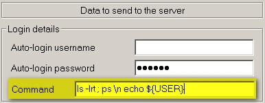

### Force CR/LF on the Enter key

By default, pressing Enter sends a single carriage return to the remote host. In some situations it's useful to send a full CR+LF line ending instead, which is what certain servers and devices expect to recognise the end of a line. This option lets you force that behaviour so your input is interpreted correctly.

**How to enable:** Tick **Terminal > 'Enter key sends CR LF'** (session key `EnterSendsCrLf`). When on, pressing Enter sends CR+LF instead of CR only — for servers that need both.

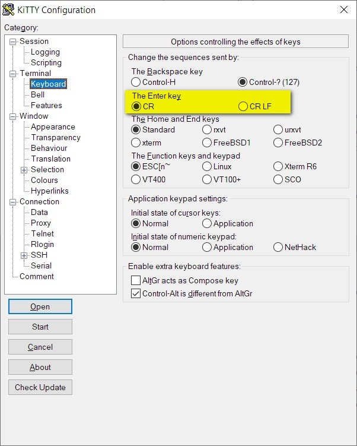

### Run a locally saved script on a remote session

KiTTY can take a script file stored on your local PC and replay its contents into the currently connected remote session. The lines from the file are sent to the remote machine as if you had typed them yourself, so you can automate repetitive command sequences without retyping them each time. This is handy for setup routines, repeated diagnostics, or any series of commands you run often on a server.

**How to enable:** Use the scripting menu / Connection > Scripting to play a locally stored script line-by-line into the active remote session.

(no screenshot)

### Session logging with timestamps

KiTTY writes a session's output to a log file, and can stamp every logged line with the time it was written — which is what turns a log from a transcript into something you can correlate with a ticket, a monitoring alert or another machine's log.

The stamp is a **strftime** pattern, so you choose the layout: `%Y-%m-%d %H:%M:%S ` gives `2026-08-12 15:31:55 `, and `%d.%m.%Y %H:%M:%S: ` gives `12.08.2026 15:31:55: `. In addition to the standard strftime codes, **`%f`** inserts milliseconds. **Leave the field empty and no timestamps are written** — logs look exactly as they did before, so nothing changes unless you ask for it.

The **log file name** takes its own substitutions, which is how you keep one file per host or per day instead of overwriting a single file: **`&H`** host name, **`&P`** port, **`&Y` `&M` `&D`** year/month/day, **`&T`** time as HHMMSS, and `&&` for a literal `&`. So `kitty_&H_&Y&M&D.log` becomes `kitty_server1_20260812.log`. Characters that are illegal in a Windows file name are replaced automatically, so an IPv6 address in `&H` cannot produce an unusable name.

Timestamps apply to the session logs — *Printable output* and *All session output*. The SSH packet and raw-data logs are deliberately left alone: they already timestamp every record in their own format, which other tools parse.

If you would rather not learn strftime to try it, the button under the field fills in a sensible pattern; press it again to clear it. Its label always says which of the two it will do.

**Rotation.** *Log rotation delay* starts a new log file every N seconds, so a long-running session becomes a series of manageable files instead of one that grows all week. This only works if the file name changes with time — put `&T` in it, as in `kitty_&H_&T.log`. If the name has no time-varying code, KiTTY **declines to rotate** and says so in the Event Log, because reopening the same name would overwrite the log instead of rotating it.

**Reading the log while you work.** The window menu's **Tools** section opens the log this session is writing, in whatever your system opens `.log` files with — no hunting for the file, and it works with a rotating name, where the "current" file changes through the day. Next to it is an item that either clears the log or starts a new one, and says which: with a fixed file name it can only empty the file, with a time-varying name it starts a fresh one and keeps the old.

Both can be given keys in `kitty.ini`, which is worth doing if you check logs often:

```ini
[Shortcuts]
openlogfile={CONTROL}{SHIFT}L      ; open this session's log file
eventlog={CONTROL}{SHIFT}E         ; show the event log (KiTTY's own record)
```

**How to enable:** **Session > Logging**. Choose what to log, set *Log file name*, then put your pattern in *Timestamp (strftime format)* — or press the button beneath it. For rotation, set *Log rotation delay* and include `&T` in the file name.

(no screenshot)

### Standard output to the clipboard

KiTTY can route a session's terminal output straight into the Windows clipboard. By treating the clipboard as a kind of printer, you can capture the result of any remote command and paste it directly into another Windows application, with no manual selecting or copying. It's a handy way to grab a directory listing, a config file, or any command output and reuse it locally.

**How to enable:** Pick **'Windows clipboard'** as the printer in **Terminal > printing** (or tick *Print to clipboard*). Then send terminal output to the clipboard with the ANSI printer-controller sequence: `printf '\e[5i'; cat file; printf '\e[4i'`.

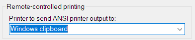

### Restricted process ACL (-restrict-acl)

Inherited from PuTTY: starting KiTTY with the `-restrict-acl` command-line option locks down the Windows process ACL, so other programs running under the same user account cannot open the KiTTY process (for example to read its memory, which holds session passwords while connected). Every window KiTTY spawns from such a process — sessions started from the configuration box, duplicates, "open new with current settings" — inherits the restriction. `kageant` and `kittygen` accept the option too. Be aware of the trade-offs before enabling it: the lockdown also blocks legitimate same-user tooling such as screen readers and other accessibility or automation software, and during an in-place MSI upgrade the Windows Restart Manager cannot inspect restricted windows, so the installer reports *"a critical application holds files in use"*, offers no close-and-restart handling and simply closes the windows. Up to and including 0.84.1.60, sessions spawned from the configuration box ran with this restriction unintentionally — always, regardless of options; since 0.84.1.61 it applies only when requested.

**How to enable:** off by default, and there are two ways to turn it on.

Per shortcut, add `-restrict-acl` to the command line, typically in your shortcut target: `"C:\Program Files\KiTTY\kitty.exe" -restrict-acl` (with the launcher: `kitty.exe -restrict-acl -launcher`).

**How to tell it is actually on.** Failing to *apply* the ACL is loud — KiTTY reports it and exits rather than run unprotected — but a setting that is never read is silent, and `kitty.ini` has several candidate locations, so it used to be possible to believe you were hardened when you were not. A restricted process now says so, in the places you already look:

- the **window title** carries `(RESTRICTED)`, beside `(PROTECTED)` and `(ONTOP)` (needs `wintitle=yes`, the default);
- the **configuration box** title carries it too, which is what you see when you start KiTTY without a session;
- the **About box** of both KiTTY and `kageant` says so in words;
- the **tray tooltips** of `kageant` and of the launcher show `(RESTRICTED)`.

All of them report the process's real state, not the setting, so a `-restrict-acl` shortcut, an inherited restriction and `restrictacl=yes` all show identically. It means "this process's ACL is locked down" — nothing wider. `kittygen` never shows it, because it does not read the `kitty.ini` key.

Globally, put `restrictacl=yes` in the `[KiTTY]` section of your `kitty.ini`. That applies the restriction to every KiTTY process that reads the file, so you do not have to edit each shortcut target, and it is applied early in startup — before the command-line switch would be. **`kageant` honours the same key**, so the process that actually holds your loaded private keys is covered by the one setting; it applies the ACL at the top of its startup, before any key is loaded. `kittygen` does not read it — pass it `-restrict-acl` if you want it hardened. `yes` is the only value that does anything: a process cannot un-restrict itself, so `restrictacl=no` does not lift a restriction that `-restrict-acl` or a parent window already applied. If the ACL cannot be applied, KiTTY reports the error and exits rather than run unprotected — the same fail-closed behaviour as the switch.

Unlike most `[KiTTY]` settings, `restrictacl` is read from `kitty.ini` only and never from the registry. Global settings are normally looked up in the registry first and in `kitty.ini` only as a fallback; for a hardening switch that order fails open, because a leftover registry value would silently cancel the `restrictacl=yes` you wrote in the file.

Note that enabling it globally also applies the upgrade trade-off above to every window: an in-place MSI upgrade will close your sessions without reopening them, because the Restart Manager cannot inspect a restricted process.

(no screenshot)

---

## Graphical features

### An icon for each session

KiTTY lets you assign a distinct window icon to each saved session, so you can tell your terminals apart at a glance in the taskbar and on screen. You can pick from a large set of built-in icons (more than fifty, ranging from PuTTY-style logos to numbered and cartoon icons) or point to your own .ico file. There's even a "random icon" option that picks a different one for you each time.

**How to enable:** Configuration > **Window > Appearance**: choose a per-session icon (from the embedded icon set or a .ico file).

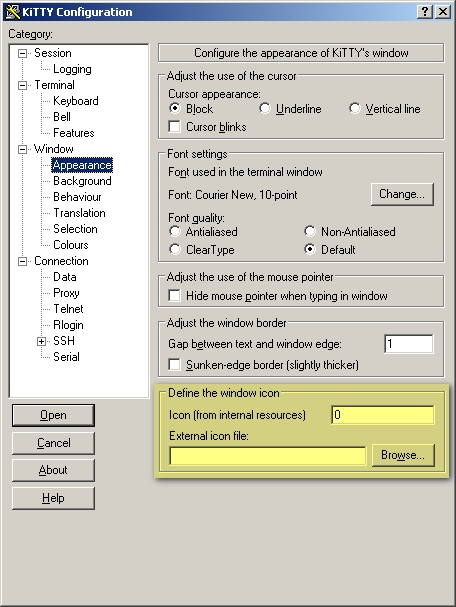

### Send to tray

When you run long background batches or just keep KiTTY open to maintain SSH tunnels, you can tuck the window away into the Windows system tray (the notification area in the bottom-right corner of the screen) so it stays out of your way. You can send an open session to the tray on demand, have a session start there automatically, or launch one straight into the tray from the command line. Clicking the tray icon brings the window back when you need it.

**How to enable:** System menu **Send to tray** for a window that is already open. To have a session start there, tick **Send to tray on startup** in Configuration > **Window > Behaviour**; on the command line, `-send-to-tray` does the same for one launch. A session starting in the tray stays visible until it is actually connected, so host-key and password prompts are never hidden behind the tray icon. With the option on, minimising the window also sends it to the tray. Click the tray icon to restore it.

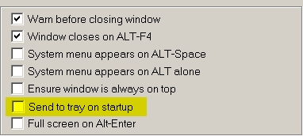

### Transparency

KiTTY lets you make a terminal window see-through, so you can watch what's happening behind it while you work. You set how transparent the window is, and you can fine-tune the level on the fly using the numeric keypad: **CTRL +** (or **CTRL+UP**) makes the window more opaque, while **CTRL -** (or **CTRL+DOWN**) makes it more transparent. The setting can be defined separately for each session. Note that transparency may interfere with certain window-management or screen-capture tools, so leave it off if you rely on those.

**How to enable:** Configuration > **Window > Transparency** (set the level), and the system-menu **Transparency +/-** items to adjust it live. `0` is fully opaque and is the default for a new session; `255` is as see-through as it goes. Set a session to `-1` to lock it opaque — the menu entries are then not offered and the keyboard shortcuts decline, which is what you want when an accidental **CTRL+DOWN** must never dim that window. `transparency=no` in the kitty.ini `[KiTTY]` section removes the feature altogether, for every session.

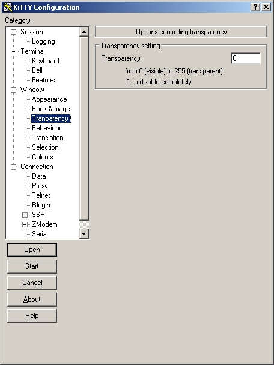

### Protection against keyboard input

KiTTY lets you shield a session against accidental or unintended keystrokes. When you turn on **Protect**, the terminal window ignores all keyboard input, so a stray key press can't disturb a running command or important output. You can also toggle this mode with the **CTRL+F9** key combination, and the window title changes while protection is active so you can tell at a glance that the session is locked.

**How to enable:** System menu **Protect** — locks the keyboard so accidental keystrokes can't reach the session.

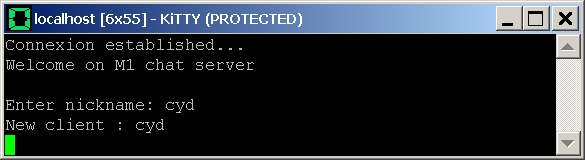

### Roll-up

Roll-up makes the window collapse "into" its title bar, hiding the terminal area so only the title bar remains visible. It's a handy way to save screen space and keep your desktop tidy when you have several windows open, and you can expand the window again whenever you need it. Besides the menu item, you can also roll up by pressing CTRL+F12, or by holding CTRL and clicking the title bar with the left mouse button.

**How to enable:** System menu **Roll-up** — shades the window down to just its title bar (click again to restore).

(no screenshot)

### Always on top

Always on top (formerly "Always visible") keeps a KiTTY window in the foreground, on top of all your other windows, so you can keep an eye on it while you work elsewhere. This is handy for monitoring a session, a log, or a long-running command without it slipping behind other applications. You can toggle it from the system menu, or with the **CTRL+F7** keyboard shortcut. While active, the window title carries an **(ONTOP)** marker.

**How to enable:** System menu **Window > Always On Top**.

(no screenshot)

### Font management

KiTTY adds a **Font settings** option to the main menu that lets you adjust the terminal's appearance on the fly. From here you can increase or decrease the font size, switch to negative colors, and toggle between black-on-white and white-on-black backgrounds. Font size can also be changed quickly by holding **CTRL** and scrolling the mouse wheel.

**How to enable:** System menu **Font Up / Font Down** to resize the terminal font on the fly.

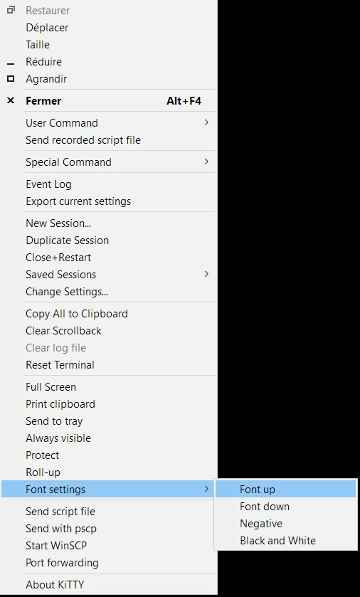

### Line spacing

Terminal fonts pack their lines tightly. **Line spacing** stretches each row to a percentage of the font's own line height, so text is easier to read without changing the font size. 100 % leaves the font's metrics untouched; above that, the extra height is shared evenly above and below the text.

Past 100 %, line-drawing characters no longer join up between rows — the gap between cells is real, and the terminal cannot draw across it. That is why the default is 100 %.

**How to enable:** Configuration > **Window > Appearance** > **Line spacing (100-300 %)**.

### Word navigation modifier

In a terminal, jumping the cursor a whole word left/right is driven by an xterm
escape sequence that the remote shell binds to *backward-word* / *forward-word*.
PuTTY emits it on **Alt + ←/→**. KiTTY adds a setting to choose which modifier
sends it — **Alt** (the default, unchanged), **Ctrl**, or **Both** — so you can do
word navigation with **Ctrl + ←/→** if that matches your shell bindings or muscle
memory.

**How to enable:** Configuration box → **Terminal → Keyboard → "Word navigation
(Left/Right arrows)"**, pick Alt / Ctrl / Both.

This option only takes effect when **Shift/Ctrl/Alt with the arrow keys** is set to
**xterm-style bitmap** — KiTTY's default. In the *"Ctrl toggles application mode"*
setting the arrow-key modifiers aren't encoded, so no word-navigation remapping is
possible.

(no screenshot)

### Quick start of a duplicate session

KiTTY lets you instantly open a second window that inherits all of the current session's settings, so you can run another connection to the same host without reopening the launcher or re-entering details. For an even faster shortcut, hold **CTRL + SHIFT** and click the middle of the active window with the **left mouse button** to launch the duplicate.

**How to enable:** System menu **Duplicate Session** — opens a new window with the current session's settings.

**Inherit New Session...** is the same idea with a stop: the new window comes up at the **configuration box** carrying those settings, so something can be changed before connecting. Otherwise the box opens without a host, ready for a fresh one.

#### Working through a cluster, one key at a time

Put the two together and a room full of near-identical machines takes one keystroke each.

1. Work in **quick connect**. Either start from **Default Settings** once — which arms it until you load some other session — or set `loadlastsession=no` under `[ConfigBox]` in `kitty.ini` to work that way always.
2. Bind Inherit New Session to a key, e.g. `opennewcurrent={CONTROL}N` under `[Shortcuts]`.

Now, from any connected window, **CTRL+N** opens a configuration box with everything from that session — user, port, keys, appearance, the lot — and the **host name already in it and selected**. Type over it for an unrelated machine, or edit the one character that differs (`web01` → `web02`), press **Enter**, and you are connected. Repeat from the new window and you walk the whole cluster without touching the launcher or retyping a single setting.

(Binding CTRL+N does take `^N` away from the shell in that window; pick another key if you need it.)

(no screenshot)

### Window title placeholders

KiTTY can expand dynamic placeholders in the **Window Title** setting so the title reflects the active connection.

**How to use:** Enter a title string such as `%%h - %%s` in the session's **Window Title** field. The available placeholders are:

| Placeholder | Value shown in the window title |
|---|---|
| `%%h` | Hostname (falls back to the configured host) |
| `%%s` | Saved session name |
| `%%u` | Username |
| `%%p` | Port number |
| `%%P` | Protocol display name (e.g. `SSH`) |
| `%%f` | Folder name the session belongs to |
| `%%l` | Local forwarded ports (blank if none configured) |
| `%%d` | Dynamic/SOCKS forwarded ports (blank if none configured) |

For full details and examples, see [`docs/window-title-placeholders.md`](docs/window-title-placeholders.md). If a remote shell later replaces the title, enable **Terminal → Features → Disable remote-controlled window title changing** (`NoRemoteWinTitle=1`) to keep the placeholder-expanded title.

(no screenshot)

### Background image

KiTTY can display a picture behind your terminal text, giving each session window a custom backdrop. It supports BMP and JPEG images, and you can adjust how strongly the image shows through with an opacity setting or rotate through several pictures as a slideshow. This feature grows out of the covidimus patch integrated into KiTTY.

**How to enable:** Add `bgimage=yes` to `[KiTTY]` in kitty.ini (the key is `bgimage`, not `backgroundimage`), then configure **Window > Back.Image** (image file, opacity, slideshow).

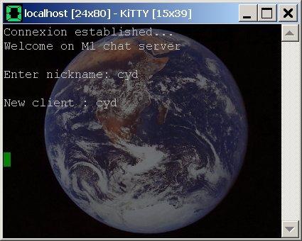

---

## Other features

### Automatic saving

KiTTY can keep a registry-mode backup of its settings, sessions, and host keys as **kittynew.sav** files. KiTTY writes a *fresh, timestamped* `kittynew-YYYYMMDD-HHMMSS.sav` — so the filename always reflects when that copy was written — and keeps the newest `[KiTTY] savbackupcount` of them (default 5). It is written when you open a session from the configuration dialog, when you apply **Change Settings** in a running session, when you add, edit or delete a named proxy, and — this is the case backups exist for — **immediately before you overwrite an existing session, delete a session, or delete a folder**. (Saving a session under a new name writes no backup: there is nothing yet to preserve.) Those three are taken *before* the change, so the newest backup still contains whatever you just overwrote or deleted; the others are taken afterwards and run in the background so they never hold up the dialog. Starting a session from the **Start** button does not write one. By default they live under `%APPDATA%\KiTTY` next to `kitty.ini`; advanced users can override the base path with `[KiTTY] sav=`. The name is `kittynew.sav`, not `kitty.sav`, so an older KiTTY installed side by side never has its backup overwritten.

**Backup/restore:** each `kittynew-*.sav` is a Windows Registry export of KiTTY's configuration hive. To restore one, close KiTTY/kageant/launcher first, then import the chosen file with Registry Editor or `reg import kittynew-YYYYMMDD-HHMMSS.sav`, and start KiTTY again. Backups are plain, unencrypted `.reg` files: the registry already holds saved passwords in protected form, so a second layer added nothing. Backups written by older versions with the retired configuration-password feature are still readable — KiTTY prompts for that password while loading one.

**What a restore brings back — and what it does not.** The file is written by Windows' own registry exporter, so every value returns with its original type and content: sessions, host keys, host CAs, named proxies, folders, window placement, kageant's startup keys, settings. The one thing that does not travel is **saved passwords on a different machine or user account**: in registry mode KiTTY protects them with Windows DPAPI, which is tied to the account that saved them. Restored on the same machine and account, everything comes back as it was; restored anywhere else, you get your sessions but their stored passwords have to be entered again. This applies to registry mode only — a **portable** store protects passwords with your master password, and is deliberately built so they can be unlocked on another machine, which is the whole point of carrying one around.

**Portable directory mode** (`kitty_portable.exe` / `savemode=dir`) is not affected by any of the above — it stores sessions as files and its backups are plain file copies. When settings are applied, KiTTY refreshes `Backups\kitty-portable-latest` and keeps timestamped backups such as `Backups\kitty-portable-YYYYMMDD-HHMMSS` under the portable config directory. By default it keeps 5 timestamped backups; set `[KiTTY] portablebackupcount=0` to disable or another number to change retention. The backup contains **everything in your portable configuration directory** — `kitty.ini`, `Sessions`, `Proxies` (named proxy definitions), `Security` (master-password salt/verifier), `SshHostKeys`, `SshHostCAs`, `Launcher` and the rest — so a restored backup keeps its sessions, proxies, launcher entries and master-password protection intact, and anything the store gains in future is included automatically. Only four things are left out: the programs themselves, the `Backups` folder, session logs (`*.log`) and any leftover diagnostic dumps (`*.dmp`) from versions before 0.84.1.65. To restore, close KiTTY/kageant/launcher and copy the backup contents back into the portable config directory.

**How to enable:** Automatic in registry mode: on each of the events above, KiTTY exports its registry hive to a timestamped **kittynew-*.sav** (in `%APPDATA%\KiTTY`, or the `[KiTTY] sav=` path) as a safety backup, keeping the newest `savbackupcount`.

(no screenshot)

### Non-blocking connection errors

When a connection drops, is closed by the remote host, or the server reports a non-fatal error, KiTTY prints the message **inline in the terminal** rather than popping a modal dialog that blocks the window until you click **OK**. The window stays usable and closable, and the text remains in the scrollback so you can read or copy it. A **fatal** disconnect also badges the window title with a **⚠ (disconnected)** marker, so a minimised or background window shows at a glance that its session died; the marker clears automatically the next time the session connects. Host-key and weak-crypto confirmations still use a normal prompt.

**How to enable:** on by default. To restore the classic modal error boxes, set `[KiTTY] modalerrors=yes` in `kitty.ini`.

(no screenshot)

### Run the clipboard as a command

KiTTY can run the current Windows clipboard contents as a local command with the **Ctrl+F5** shortcut — handy for sending a prepared command line straight into execution. Because that runs whatever happens to be on the clipboard, KiTTY shows a **confirmation prompt** (displaying the command) before running it and a **tray notification** after launch, so nothing runs unexpectedly.

**How to enable:** the shortcut is built in; the two safeguards are on by default and toggled per session in **Window → Selection** ("Running the clipboard as a local command").

(no screenshot)

### The remote clipboard (OSC 52, OSC 5522, far2l)

A program on the remote host — `tmux`, `vim`, `nvim`, or anything that emits the standard **OSC 52** sequence — can put text straight onto your Windows clipboard, so yanking in a remote editor gives you something you can paste locally without selecting it with the mouse first. Only **text** travels this way; the sequence carries nothing else, so images and other clipboard formats are unaffected. A payload that arrives truncated or malformed is refused whole rather than pasted in part.

**Writes are set to Ask by default, and this is deliberately stricter than other terminals.** The answer lasts for the rest of the session, so a host that copies for you costs one dialog on its first copy and nothing afterwards.

<details>
<summary>Why Ask, and when to change it to Allow</summary>

**What the others do.** Ghostty permits OSC 52 writes unconditionally; Alacritty ships `OnlyCopy` — writes yes, reads no; kitty writes by default. On that evidence KiTTY first shipped **Allow** too, and there is a real argument for it: this direction cannot disclose anything to the host. Nothing of yours leaves the machine.

**Why we changed our mind.** Not leaking is not the same as harmless. A host that silently replaces your clipboard chooses what you paste *next* — and the next paste may go into a root shell, a config file, or a payment field. The classic form of this is a copied command that arrives with a trailing newline, so it does not merely land in your shell, it *runs* there. Nothing leaves the machine; something arrives on it, of the host's choosing, at a moment you think you are in control of.

**Why asking is affordable here, when it is not for reads.** The write question latches: one dialog per session, not one per copy. That matters, because a prompt people do not think is warranted is how a protection ends up switched off wholesale — kitty's own users describe its clipboard warnings as "so annoying that everyone will look for a fix and disable" them, and Ghostty has bug reports of read prompts firing repeatedly from nothing worse than Neovim polling the clipboard over SSH. A once-per-session question is not that.

**Set it to Allow if** you work mainly on hosts you administer yourself, and you copy from remote editors constantly enough that even one dialog per session is friction you would rather not have. What you give up: a compromised or hostile host — including one you trust that someone else does not — can put anything it likes on your clipboard at any time, and the first you would know of it is the title-bar marker and the frame tint. Those stay on either way, which is why Allow is a reasonable choice rather than a reckless one.

**Set it to Deny if** you never want a remote host touching the clipboard at all. Nothing else changes; local copy and paste are unaffected.
</details>

**Deny**, **Allow** or **Ask**, per session.

**Reads are the other direction, and are treated very differently.** Here the host asks KiTTY to send *your* clipboard back to it — the exfiltration risk for which upstream PuTTY omits OSC 52 altogether. A clipboard holds a password often enough to matter, and the host chooses the moment it asks, so reads default to **Deny** and there is deliberately **no Allow setting**. A read can be permitted only by answering the prompt, which shows how much text would be sent and the first few characters of it, and which offers to allow that one request, the next few minutes, a number of requests, or the rest of the session. **Deny** is the default button, the narrowest option is pre-selected, and no permission to read is ever written to disk.

Three protections apply to every clipboard protocol at once:

- **Focus.** Nothing leaves the window while you are working somewhere else. An existing permission is *suspended*, not cancelled, and resumes without asking again when you return.
- **Limits.** How many reads a grant is worth, how close together they may come, how often you can be prompted, how large a payload may be (16 MB, enough for a 1080p image and far more than any text), and how often a server may overwrite your clipboard (10/second). A host that asks faster than the pacing limit has that request refused — it does not cost you the permission you gave.
- **Visibility.** The title bar shows a clipboard icon with an arrow — up when data left you, down when the host put something in — and on Windows 11 the frame is tinted, amber for a read and blue for a write. A standing permission appears at the end of the title in brackets. Tray notifications cover refusals and oversized payloads.

**KiTTY also answers the kitty terminal's clipboard protocol, OSC 5522.** Unlike OSC 52 it can identify the program asking, so one you have approved is not asked about again while that grant lasts, and it reports real error codes instead of silence. Reads use the same permission and the same limits — one permission reachable two ways, not two settings. Writes answer *not implemented*, so an application falls back to OSC 52 for text.

**A remote `far2l` session shares the clipboard both ways** on its own protocol, under the same focus rule and the same size ceiling.

**How to enable:** **Window → Selection → Remote clipboard** for the three permissions and the focus rule; **→ Limits** for the numbers; **→ Notices** for the title and tray markers.

(no screenshot)

### Paste size guard

Pasting into a terminal executes whatever the clipboard contains, line by line — so an accidental paste of the wrong (or huge) clipboard can flood the shell with unintended commands. KiTTY can ask for confirmation before pasting more than a configurable number of characters, telling you how large the clipboard is so you can abort a mis-aimed paste.

**How to enable:** on by default since 0.84.1.73-beta — a paste of more than 5120 characters asks first, as Windows Terminal does. Set `pastesize=<N>` in the kitty.ini `[KiTTY]` section to choose your own threshold, or `pastesize=0` to turn the confirmation off entirely.

(no screenshot)

### In-app updater (Check for updates)

KiTTY can check whether a newer release is available and install it for you. *Check for updates* queries the official release list and, if a newer build exists, fetches the right asset for **how KiTTY was installed**: the per-user MSI, the system MSI (with an elevation prompt), or — for a **portable** copy — it just opens the download page. The downloaded installer runs only after it passes an **Authenticode check** (valid signature chain *and* the expected KAPPER publisher), is downloaded to a unique temporary `.msi` path, and is held locked against modification from verification through launch; anything that fails verification, fails to launch, or is cancelled is deleted and never run. A **stable** build will not silently install a **beta**: if the newest available build is a beta, KiTTY tells you and asks first (proceed with caution). The launcher also surfaces update availability in its tray tooltip and menu.

**How to enable:** system menu → **Check for updates**. Requires network access and honours your system/IE proxy settings; if the check can't complete it falls back to opening the releases page.

(no screenshot)

### pscp.exe and WinSCP integration

KiTTY lets you transfer files without opening a separate program, reusing the host and credentials of your current session. From the system menu you can send a file straight into the running session with pscp (CTRL+F3) or open a full WinSCP file-transfer session on the same server (SHIFT+F3), and you can also drag and drop a file or folder directly onto the terminal window to upload it. Helper shell functions are available so that, from within a UNIX session, you can grab a file or launch WinSCP in your current directory with a single command.

**Directory-aware uploads (OSC 7).** Enable **Track remote directory (OSC 7 shell integration)** in **Connection → SSH → KSCP and WinSCP** and drag-and-drop uploads — and *Start WinSCP* — target your shell's **current remote directory** instead of your home directory. KiTTY reads the directory from the standard **OSC 7** sequence (`ESC ] 7 ; file://host/path BEL`) your shell emits on every prompt, validated strictly as data — absolute path, whitelisted characters, never executed. It is the safe, data-only replacement for KiTTY's old "send file to the current directory" option, which was retired after that title-scan mechanism proved to be a remote-code-execution hole (CVE-2024-23749); sessions that used it are migrated to OSC 7 tracking automatically. Prefer a single hard-wired target? Use **Fixed remote upload directory** in the same panel (mutually exclusive with tracking). Two lines in your shell startup enable OSC 7 — see [docs/examples/osc7-shell-integration.md](docs/examples/osc7-shell-integration.md).

**How to enable:** Configuration: set the WinSCP/pscp path (SCP/WinSCP options). System-menu items then launch a file transfer reusing the session's host and credentials.

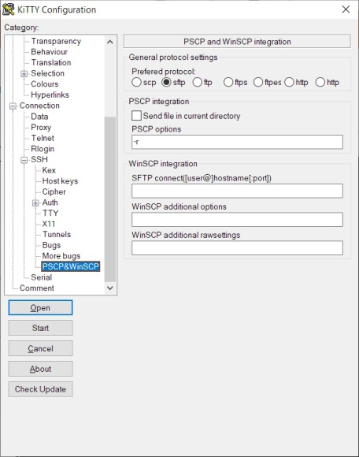

### Binary compression

To keep the download small, KiTTY's executables are compressed with UPX, the Ultimate Packer for eXecutables. This shrinks the binary file size without changing how the program runs, so you get the same KiTTY in a more compact file. The compression is transparent in everyday use.

**How to enable:** No action needed: the shipped kitty.exe and kitty_portable.exe are UPX-compressed for a smaller download; identical uncompressed `*_nocompress.exe` variants are provided in the ZIP as a fallback.

(no screenshot)

### Clipboard printing

KiTTY lets you send text straight from the terminal screen to a printer. Use the mouse to select the section of text you want, then trigger the print action and the selected contents are sent to your printer device. It's a quick way to get a hard copy of command output, logs, or any on-screen text without saving a file first. You can also invoke it with the **Shift+F7** shortcut.

**How to enable:** System menu **Print clipboard** — sends the current clipboard contents to a printer.

(no screenshot)

### Start Cygwin or cmd.exe inside KiTTY

KiTTY can host a local shell right inside its terminal window, so you can run a Cygwin session, the Windows `cmd.exe` prompt, or even PowerShell without leaving KiTTY. This is handled by a small helper called `cygtermd.exe`, which you place in your Cygwin `/bin` directory (or alongside `kitty.exe` together with `cygwin1.dll` if you don't have a full Cygwin install). When launching `cmd.exe` this way, remember to pick the matching code page in the Translation settings (or via the `-codepage` option), and you can combine cygtermd with the winpty tool to run `cmd.exe` or PowerShell. With thanks to lars18th for the help.

**How to enable:** Run a local shell via the cygtermd helper, e.g. `kitty.exe -localproxy "C:\cygwin64\bin\cygtermd.exe /home/%USERNAME% /bin/bash -login" localhost`.

(no screenshot)

### Local terminal (kitty_pterm)

`kitty_pterm.exe` is KiTTY's terminal **emulator** running a **local shell** instead of a network connection. You get the exact same terminal as a KiTTY SSH window — fonts, colour schemes, mouse selection/copy-paste, scrollback, clickable URLs, transparency — but the backend is a local process (via the Windows ConPTY pseudo-console). Its value is consistency: your local shell looks and behaves just like your remote sessions. It is an interactive terminal, not a scripting tool, and has no special tie to saved sessions beyond sharing the appearance.

**How to change the shell (cmd → PowerShell):** by default it runs `cmd.exe`. Launch it with `-e` to run a different shell, e.g. `kitty_pterm.exe -e powershell.exe` (Windows PowerShell) or `kitty_pterm.exe -e pwsh.exe` (PowerShell 7). For a saved session, set the same command in **Connection → Data → "Remote command"**.

(no screenshot)

### File association

KiTTY can export the settings of your running session to a plain-text file with the **.ktx** extension, using the **Export current settings** item in the main menu. Once the **.ktx** file type is associated with KiTTY, you can launch any saved session simply by double-clicking its file. This makes it easy to share ready-to-run sessions or keep handy shortcuts to the connections you use most.

**How to enable:** run **`kitty.exe -fileassoc`**. As administrator it associates `.ktx` for everyone on the machine; run normally it does so for your account, and the machine-wide installation asks for the rights itself. If another program already opens `.ktx`, that is reported and left alone — the same `-force`, `-user`, `-yes` and `-uninstall` options as [`-sshhandler`](#ssh-handler-urlos-integration) apply, including the exported `.reg` backup and the command that undoes the change.

(no screenshot)

### Export all / Import all sessions

Beyond exporting a single session, KiTTY can move your **whole set of saved sessions** — and your named proxy definitions — between installs or machines. **Export all…** writes every saved session as a `.ktx` file into a folder you choose (plus a `Proxies\` folder for named proxies); **Import all…** reads them back from a folder. When you import into a store that already contains sessions or proxies of the same name, KiTTY asks once whether to overwrite them or import only the new ones, and then reports how many sessions and proxies were imported, kept, or failed. Both pickers are the modern folder dialog with an address bar you can paste a path into.

**The exported files get their own password.** Exporting asks how the bundle should be protected, and the choice covers the sessions and the proxy definitions together:

- **a password you choose** — the files can then be imported on any PC. It is shown once when the export finishes, with a **Copy** button, because it is the only thing that opens them again. Importing asks for it, calling it the *import password*; three wrong tries and nothing is imported at all.
- **this PC only** — no password. The files are encrypted with Windows DPAPI and can only be imported with the same Windows account on the same PC. Importing such a bundle asks nothing; opened on the wrong PC or account it says so plainly, rather than importing sessions with blank passwords.

This password belongs to the exported files alone. It is **not** your master password, and exporting changes nothing about the sessions saved on your machine — before 0.84.1.65 exporting quietly turned the password you typed into a master password for your own store, which is no longer the case. Imported passwords are always re-protected by the store they arrive in: Windows DPAPI in the registry, your master password in a portable install.

**Rolling sessions out from a script.** If you generate `.ktx` files yourself rather than exporting them, you can put a password in the clear and have KiTTY take it exactly as written:

```
Password\PLAIN:hunter2\
```

The `PLAIN:` marker says "this is the password, do not try to decode it". Without it, an unmarked value has to be guessed at — KiTTY still reads the encrypted form used by old KiTTY versions, and a cleartext password that happens to look like one would be mangled. KiTTY never writes `PLAIN:` itself, and the value is re-protected by the destination store the first time that session is saved. A file containing one is a cleartext password until it is imported: treat it like any other secret and delete it afterwards. It works for `ProxyPassword` too.

**How to enable:** Use the **Export all…** / **Import all…** buttons in the Session panel of the configuration box, or the command-line options for scripted or new-PC setups:

| option | meaning |
| --- | --- |
| `-exportall <dir>` | export every saved session and named proxy into `<dir>` |
| `-importdir <dir>` | import everything from `<dir>` |
| `-bundlepwfile <file>` | the bundle password, read from the **first line** of `<file>` |
| `-bundlethispc` | export without a password, for this PC and account only |

Exporting needs one of the last two — without them it refuses rather than protecting the files more weakly, and importing a password-protected bundle without `-bundlepwfile` refuses instead of stopping to ask. The password is never taken from the command line itself, where it would be visible in the process list, in Task Manager and in shell history; a password file is readable by anything running as you, so put it somewhere sensible and delete it afterwards.

(no screenshot)

### ZModem file transfer

KiTTY integrates ZModem support (originally from LePuTTY) so you can transfer files directly over an interactive terminal session. With the rz/sz helper tools in place, you trigger a receive or upload straight from the menu and move files to and from the remote host without opening a separate file-transfer client.

**How to enable:** On by default — set the rz/sz (lrzsz) helper paths in **Connection > ZModem** and the Tools menu offers **ZModem Receive / Upload / Abort**. `zmodem=no` in `[KiTTY]` hides the panel and the menu entries.

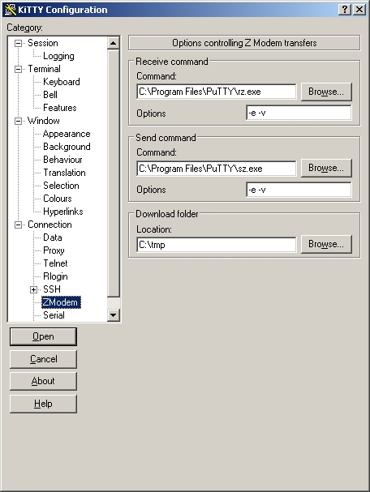

### Menu key shortcuts definition

KiTTY lets you assign a keyboard shortcut to almost any item in its main menu, so you can trigger actions like opening the connected text editor, printing the screen, running a local command, sending or receiving files, or toggling full screen without reaching for the mouse. Each action has a sensible default shortcut (for example, the editor opens with SHIFT+F2 and the local command box with CONTROL+F5), and you can override any of them to fit your own habits. This is handy for keeping frequently used commands a single keystroke away.

**How to enable:** Define key shortcuts in the kitty.ini `[Shortcuts]` section (e.g. `editor=`, `print=`, `input=`, `inputm=` ...; the full commented list is in `kitty.ini.example`).

**Syntax:** modifiers in braces, then the key — `{CONTROL}`, `{SHIFT}`, `{ALT}`, `{ALTGR}`, `{WIN}` combined freely, followed by a single letter/digit or a named key (`{F1}`…`{F12}`, `{RETURN}`, `{SPACE}`, `{TAB}`, `{HOME}`, `{END}`, `{DEL}`, …). For example, to make **Ctrl+N duplicate the current session**:

```ini
[Shortcuts]
duplicate={CONTROL}N
```

Other popular targets: `opennew=` (new session), `changesettings=`, `fullscreen=`, `visible=` (always on top), `protect=`, `rollup=`, `eventlog=`. Setting `shortcuts=no` in `[KiTTY]` disables the whole shortcut layer.

Two of these open KiTTY's *send-text* boxes: `input` (default CTRL+F8) pops up a one-line box and `inputm` (default SHIFT+F8, with CTRL+SHIFT+F8 as a fixed alias) a resizable multiline box pre-filled from the clipboard. Text is composed locally and sent to the terminal only when you confirm (OK, or SHIFT+RETURN in the multiline box; if you select part of the text, only the selection is sent) — handy on slow links, and for sending a multi-line snippet as one block. In the one-line box, a line starting with `/` is a KiTTY *internal command* executed locally instead of being sent — type **`/help`** for the full list; e.g. `/size` and `/wintitle` toggle the title-bar decorations at runtime, `/save` writes the live settings back to this window's saved session, `/savenew <name>` saves them as a new session and switches the window to it. The complete reference for every internal command — arguments, persistence, sharp edges — is in [docs/COMMANDS.md](docs/COMMANDS.md).


### PuTTY masquerade mode (KiClassName)

KiTTY can impersonate PuTTY for the benefit of external tools that only know PuTTY. With `KiClassName=PuTTY` set, the Win32 window class and the window/dialog titles become **PuTTY**, and sessions, host keys, and the jumplist are read from **and written to** PuTTY's registry hive (`Software\SimonTatham\PuTTY`) instead of KiTTY's own. That makes KiTTY a drop-in replacement wherever tooling is hard-wired to PuTTY: window/connection managers that find or embed windows by the `PuTTY` class name, automation that matches "PuTTY" window titles, and tools that provision sessions into PuTTY's registry before launching the terminal — all work unmodified while you keep KiTTY's features. Note you do **not** need this just to *see* an existing PuTTY installation's sessions: KiTTY already lists sessions from PuTTY's hive alongside its own (read-only) by default.

**How to enable:** set `KiClassName=PuTTY` in the kitty.ini `[KiTTY]` section (takes effect at startup, for all windows). For a one-off or per-shortcut override, the `-classname <name>` command-line switch sets the window class of a single window instead.

(no screenshot)

### New command-line options

KiTTY extends PuTTY's command line with a long list of extra switches, letting you control nearly every feature when launching from a shortcut, script, or the Run dialog. You can open a session straight in full screen or in the system tray, edit a session's settings, load a portable `.ktx` configuration, set a title, icon, password, or window class name, generate SSH keys, or disable individual features on the fly. All of PuTTY's original command-line options keep working alongside these additions.

**How to enable:** run **`kitty.exe -help`** (also `--help`, `-h`, `-?`) for the current list, printed at the prompt you typed it in. Frequently used ones: `-loginscript`, `-fileassoc`, `-sshhandler`, `-launcher`, `-edit`, `-kload`, `-classname`, `-title`, `-send-to-tray`, `-fullscreen`, `-noconfirm` (close the window without the "Are you sure?" prompt — handy for scripted launches; it does not affect the SSH host-key or weak-crypto security confirmations) and `-hwndparent <handle>` (embed the terminal as a child of another application's window, so connection managers such as **mRemoteNG** and **Remote4Support** can host KiTTY in their own tabs — pass the host window handle as a decimal number). A host can also be given as a URL: `kitty.exe ssh://[user@]host[:port]`, or `kitty.exe kitty://<saved session>`.

(no screenshot)

---

## Bonus

### Hidden text editor

KiTTY includes a small built-in text editor that is tied to your terminal window. It gives you a simple scratch area where you can compose or paste text before sending it to the running session, which is handy for preparing multi-line commands or notes without typing them straight into the terminal. Anything you write in the editor can be sent directly to the active session.

**How to enable:** Use terminal **Tools > Open mNotepad**, or press **Shift+F2** to open the built-in editor (**Ctrl+Shift+F2** opens it pre-filled with the clipboard). Use **Send (F12)**, **Ctrl+Enter**, or the editor's **Send** menu item to send text to the parent KiTTY session. If text is selected, the selection is sent; otherwise mNotepad sends the current line/block according to the delimiter selected in its **Delimiter** menu. The editor font is DPI-scaled on high-DPI displays.

(no screenshot)

---

## Differences vs classic KiTTY: retired and revived kitty.ini settings

A settings audit of this 0.84-based port found a number of classic kitty.ini keys
that were still parsed but had lost their effect (their consumer was never
forward-ported, was superseded, or never worked upstream either). Rather than let
them silently pretend to work, each was either removed entirely or brought back
as a working feature.

**Missing a retired setting?** If a key listed below mattered to your workflow,
please [open an issue](https://github.com/hknet/KiTTY/issues) — several keys were
revived on request exactly that way, and where feasible we will restore the
wiring of a requested feature too.

**Revived — these keys work again, properly wired (some for the first time in
the port):**

- `[ConfigBox] dblclick=start` — a double-click on a saved session acts like the
  Start button: the session launches in a new window and the config box stays
  open (`open`, the default, keeps stock behaviour).
- `[ConfigBox] noexit=yes` — closing a window that ran a connected session
  reopens the configuration box, so you land back in the session picker. Fixed
  vs classic: a window that never connected (e.g. a cancelled config box) exits
  normally, and nothing respawns during system shutdown.
- `[KiTTY] scriptmode=no` — master off-switch for the RuTTY script engine (the
  session auto-script and the "Send a script file" menu entry).
- `[KiTTY] size=yes` — appends the live terminal size `[rows x cols]` to the
  window title, updated as you resize (hidden while maximized).
- `[KiTTY] wintitle` — KiTTY's title decorations, reimplemented safely: the
  size suffix plus `(PROTECTED)` and `(ONTOP)` status markers, refreshed live
  when the state changes. `wintitle=no` gives plain stock titles. **Security
  note:** in classic KiTTY this same title machinery also *parsed* titles for
  `__xy` remote commands — that channel stays removed; decoration here is
  strictly one-way output.

**Removed — ignored if present in an old kitty.ini:**

- `[KiTTY] adb`, `capslock`, `maxblinkingtime`, `paste`, `hostkeyextension`,
  `PlinkPath`, `KiPP` — read-but-dead in all 0.84.x builds; the features they
  once toggled either no longer exist or no longer consult them (ADB support is
  simply always available).
- `[KiTTY] localcmd`, `localunsecurecmd` — the `__xy` remote metacommand
  dispatcher they gated was removed for security (remote command-injection
  surface, cf. CVE-2024-23749); the switches were a booby trap without it.
- `[KiTTY] autostoresshkey` — deliberately not supported: silently accepting
  SSH host keys defeats the host-key check, so the port keeps the confirmation
  prompt unconditionally.
- `[ConfigBox] default`, `left`, `top` — dead getters; `left`/`top` are
  superseded by the automatic config-box position memory.
- `[Agent] scrumble` — the classic key shuffle was never functional in any
  KiTTY release (its shuffle table was never built at runtime), so there is
  nothing to restore. `askconfirmation` and `messageonkeyusage` were revived
  with full — and portable — wiring on request (hknet/KiTTY#14); see the
  *Private-key usage confirmation* section.
- `[PuTTY] keys` — the KiTTY→PuTTY registry replication it triggered had no
  remaining caller.

Everything else in `docs/examples/kitty.ini.example` is verified honored.

---

## Credits

KiTTY is developed by **Cyril Dupont** ([cyd01/KiTTY](https://github.com/cyd01/KiTTY/)),
based on **PuTTY** by **Simon Tatham** and contributors. Several features integrate
third-party patches (RuTTY, the covidimus background-image patch, Patrick Cernko's
key-confirmation patch, LePuTTY ZModem, and others), credited in their sections above.
This 0.84-based port preserves those features on a current PuTTY base.
