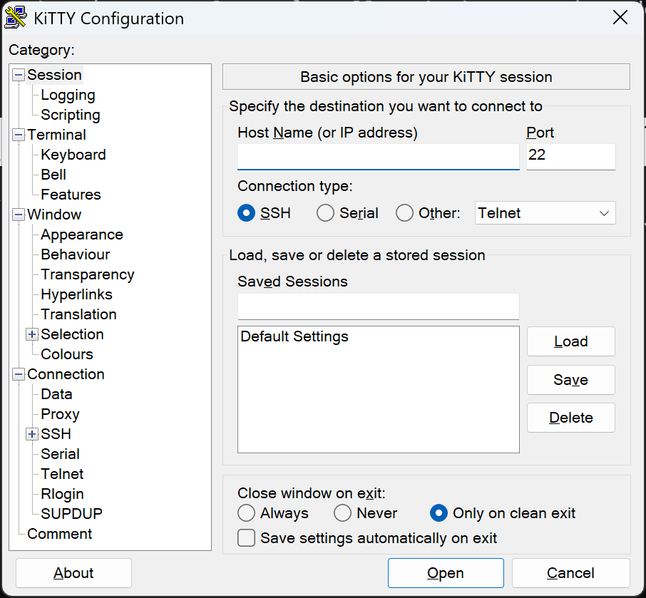
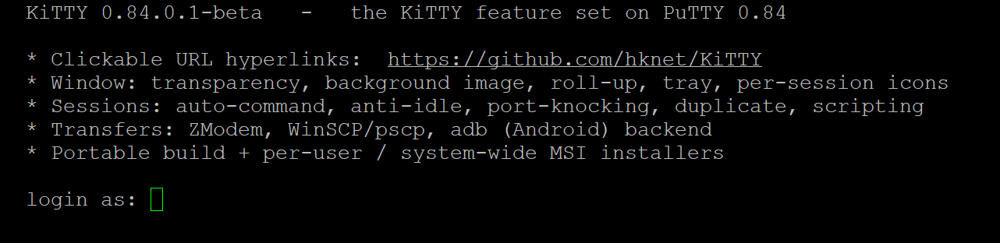

# KiTTY (PuTTY 0.84 port)

**KiTTY** is a feature-rich fork of [PuTTY](https://www.chiark.greenend.org.uk/~sgtatham/putty/),
the free Windows SSH/Telnet client. This branch is a **forward-port of the entire KiTTY feature
set onto current PuTTY 0.84** — so you get KiTTY's extras on top of a modern, security-patched
PuTTY core (≈1,200 upstream commits newer than KiTTY's original 0.76b base).

> ⚠️ **Beta release** (`0.84.1.2-beta`). Adds `kittygen-cli.exe` (console CLI key generator) and a post-quantum key-exchange warning. Please still read the known issues below.

## Screenshots

*(click an image to enlarge)*

The configuration dialog (start KiTTY with no session):

<a href="screenshots/config.png"></a>

A terminal session with a clickable, underlined hyperlink:

<a href="screenshots/terminal.png"></a>

---

## ⬇️ Download

Grab the latest build from the **[Releases page →](https://github.com/hknet/KiTTY/releases/latest)**.

Current release — **[KiTTY 0.84.1.2-beta](https://github.com/hknet/KiTTY/releases/tag/kitty-0.84.1.2-beta)**:

| Download | Use it when |
|---|---|
| **[Installer — per-user (no admin)](https://github.com/hknet/KiTTY/releases/download/kitty-0.84.1.2-beta/KiTTY-0.84.1.2-beta-x64-peruser.msi)** | **Recommended.** Installs for your user only, **no UAC prompt** (`%LOCALAPPDATA%\Programs\KiTTY`). |
| **[Installer — system-wide](https://github.com/hknet/KiTTY/releases/download/kitty-0.84.1.2-beta/KiTTY-0.84.1.2-beta-x64-system.msi)** | All users, into `Program Files` (requires admin). |
| **[Portable ZIP](https://github.com/hknet/KiTTY/releases/download/kitty-0.84.1.2-beta/kitty-0.84.1.2-beta.zip)** | No install — run from a folder or USB stick. Includes `kitty_portable.exe` and all command-line tools. |

Both installers add Start-Menu + Desktop shortcuts and an Add/Remove-Programs entry, and uninstall
cleanly. If your antivirus flags `kitty.exe` (UPX-compression heuristics), use the `kitty_nocompress.exe`
included in the ZIP — it's identical, just unpacked. Every download is checksummed (`SHA256SUMS` in the ZIP).

---

## What's included (KiTTY features on PuTTY 0.84)

~43 KiTTY features are ported and verified, including:

- **Window:** transparency, maximize / fullscreen / saved position on start, always-on-top, roll-up,
  send-to-tray (auto + on-minimize), per-session icons, background image.
- **Hyperlinks:** clickable URLs in the terminal (Ctrl+click configurable) with **underlining**.
- **Sessions & automation:** auto-command after login, auto-password, anti-idle keepalive,
  port-knocking, duplicate-session, immediate-quit, session export, scripting (rutty).
- **Transfers / backends:** ZModem send/receive, WinSCP & pscp integration, **adb** (Android) backend.
- **Terminal:** font resize, protect, print, negative/B&W colours, clear/restart log, far2l extensions.
- **Storage:** registry **or** portable file/dir storage (`kitty_portable.exe`), `kitty.ini` configuration.
- Plus the standard PuTTY tools, renamed KiTTY-style: `klink`, `kscp`, `ksftp`, `kageant`, `kittygen`.
- `kittygen-cli.exe` — a console-mode CLI key generator (generate, convert, fingerprint) for use in scripts and pipelines. Run `kittygen-cli --help` for options.

Most KiTTY extras read from a `kitty.ini` (`[KiTTY]` section). For example, URL hyperlinks are enabled with:

```ini
[KiTTY]
hyperlink=yes
```

See **[`FEATURES.md`](FEATURES.md)** for the full feature reference, including how to enable each one.

---

## Building from source

Cross-compiled to Win64 with MinGW + CMake (Ninja) under WSL/Linux:

```bash
cmake -B build-mingw -G Ninja -DCMAKE_TOOLCHAIN_FILE=cmake/toolchain-mingw.cmake
cmake --build build-mingw                 # whole tree
cmake --build build-mingw --target kitty  # just kitty.exe
```

The MSI installers are built from [`windows/installer/`](windows/installer/) with WiX v5.
For an orientation on how this fork is structured and ported — architecture, the `MOD_*` /
parallel-target approach, and the constraints to know before editing shared files — see
**[`PORTING.md`](PORTING.md)**.

---

## Credits & licence

- **PuTTY** © Simon Tatham and the PuTTY team — the upstream this is built on.
- **KiTTY** © Cyril Dupont (9bis) — the feature fork this port carries forward (https://www.9bis.net/kitty/).
- **far2l terminal extensions** (the far2l shared clipboard) — derived from the
  [**putty4far2l**](https://github.com/ivanshatsky/putty4far2l) project: far2l's PuTTY
  extensions originally by **Ivan Sorokin**, putty4far2l by **unxed**, the 0.78.5 port by
  **Ivan Shatsky**; the [far2l](https://github.com/elfmz/far2l) file manager by **elfmz** and contributors.
- This 0.84 port keeps PuTTY's **MIT licence** — see [`LICENCE`](LICENCE).

The original PuTTY source README is preserved as [`README`](README).
